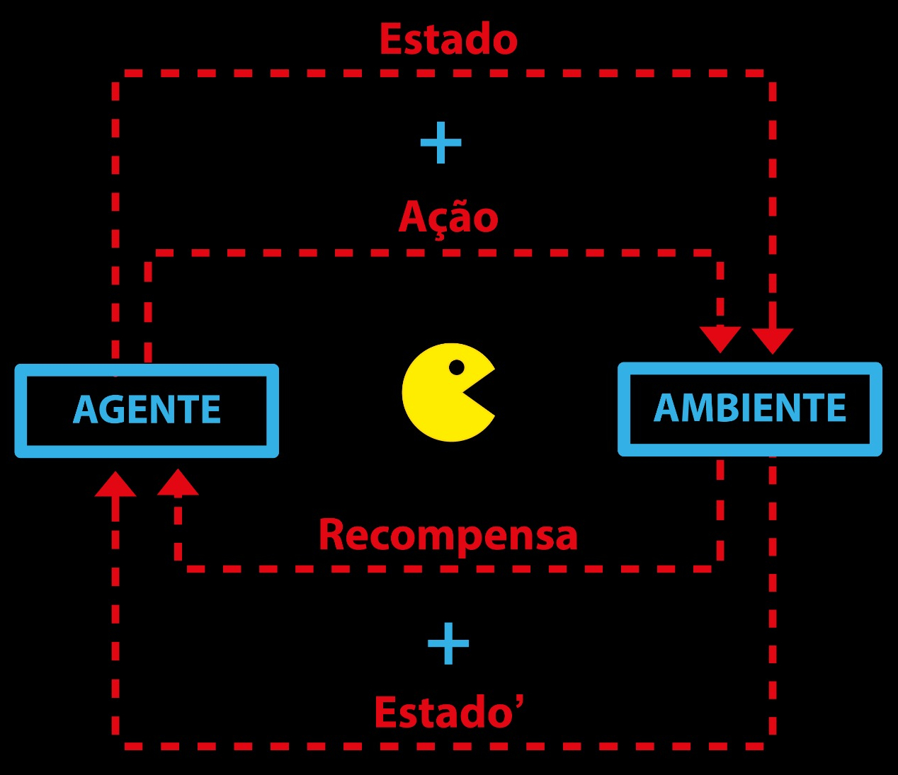
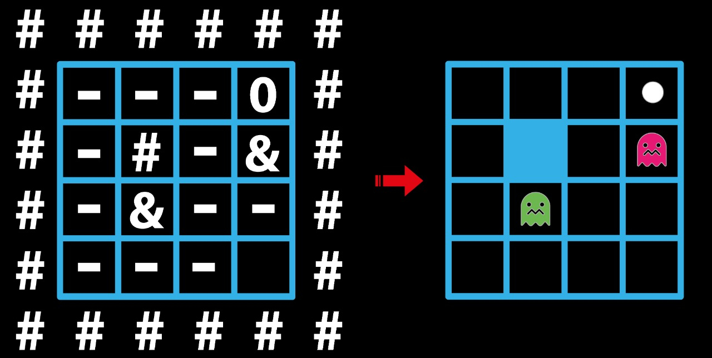

# Pac-Maze

[](https://svgshare.com/i/Zhy.svg)
[](https://jdk.java.net/)

> ⚠️ Implementação em **java** para o desafio **Pac-Maze**. Todos os detalhes do problema, a abordagem escolhida e os resultados obtidos estão descritos no [**_relatório_**](Pac_Maze.pdf) do projeto.

## Overview

Este projeto aborda a aplicação do aprendizado por reforço a uma versão simplificada do jogo **Pac-Man**, onde o objetivo do jogador é caminhar por um labirinto em busca de uma "pílula", desviando dos fantasmas, que nessa versão do game não se movem. O algoritmo implementado no aprendizado foi o **Q-Learning**, que em seguida foi testado utilizando diversas combinações de valores para a _taxa de aprendizado_ e o _fator de exploração_. Os testes foram realizados utilizando três mapas com diferentes tamanhos e níveis de dificuldade, e seus resultados foram compilados em tabelas e gráficos.



## Instalação

Clone o repositório e compile o código utilizando o comando **javac**, de acordo com o exemplo:

```Bash
git clone https://github.com/eduardoatr/Pac_Maze.git
cd Pac_Maze
javac -d . pacmaze/*.java
```

## Execução

Para executar, basta utilizar o comando **java**, fornecendo como parâmetros o **caminho** para o arquivo contendo o mapa do labirinto, seguido do valores de **alfa** (taxa de aprendizado), **épsilon** (fator de exploração) e o número de **episódios**, como mostrado no exemplo a seguir:

```Bash
java pacmaze.Main "testes/entradas/pacmaze-01-tiny.txt" 0.4 0.9 1000
```

O arquivo de entrada contendo o mapa do labirinto deve apresentar em sua primeira linha dois inteiros: **N** indicando a quantidade de linhas e **M** a quantidade de colunas. Nas próximas **N** linhas, cada uma contendo **M** caracteres, está descrita a estrutura do mapa onde as paredes do labirinto são representadas pelo caractere "**#**", já os espaços vazios são definidos por "**-**". Os fantasmas aparecem na matriz como o símbolo "**&**", e por fim, a "pílula" é representada por "**0**", de acordo com a figura:



O diretório **_testes_** contém alguns exemplos de entradas e as saídas esperadas. Para mais informações, consulte o [**_relatório_**](Pac_Maze.pdf) do projeto.
